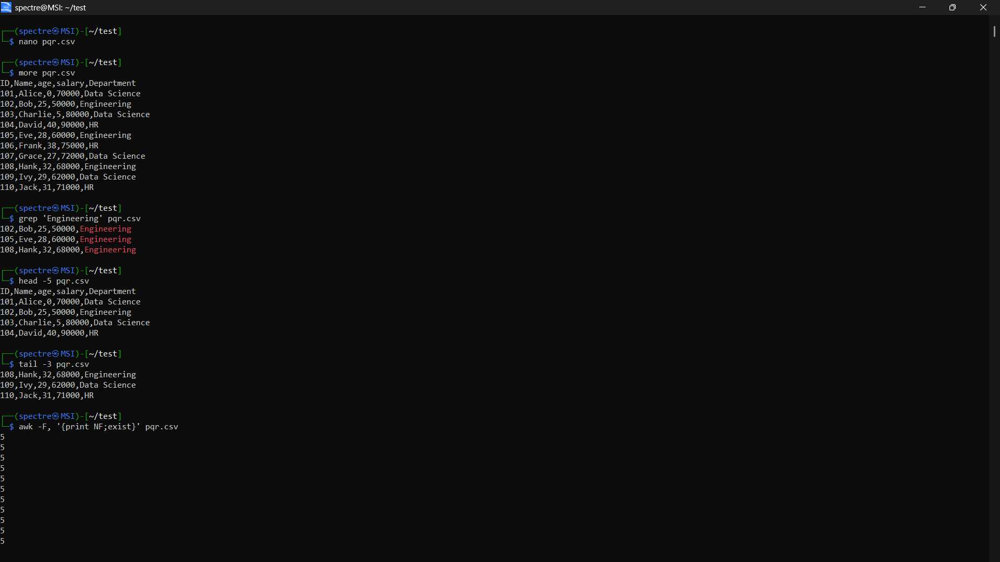
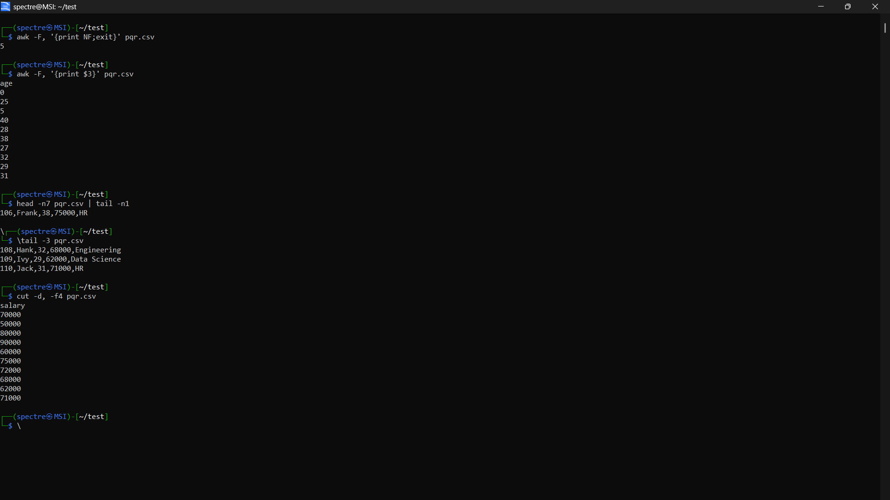
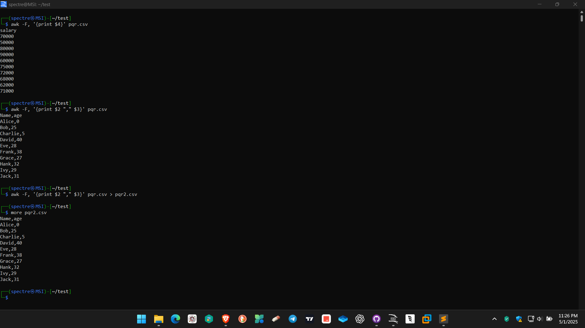
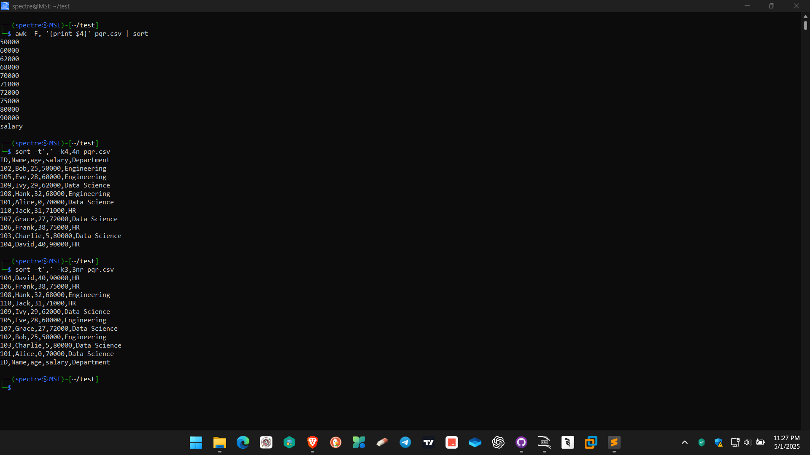
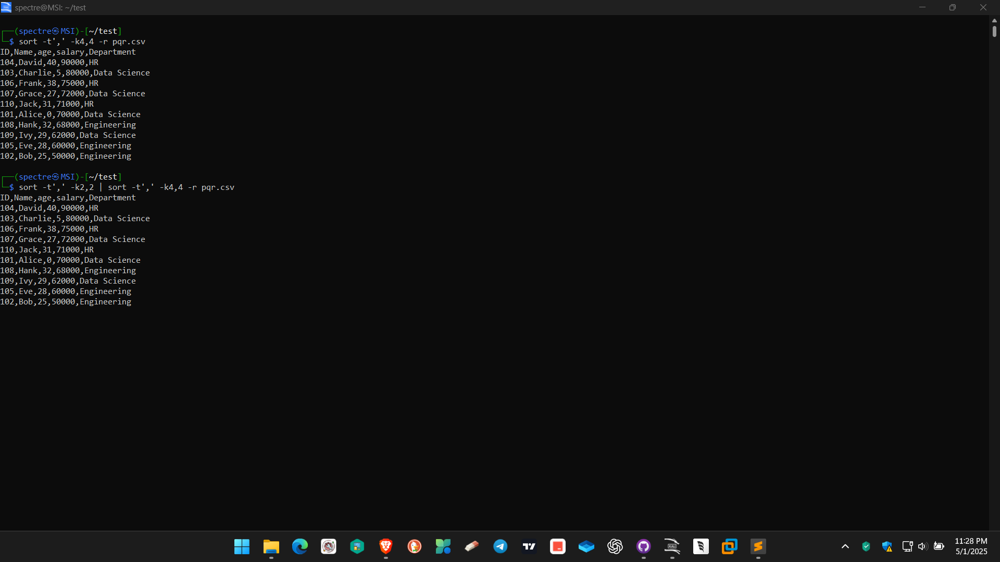

# Operating System Course - Day 06

> 📚 A comprehensive collection of daily practical lessons for Operating System course focusing on Windows batch scripting.

## 📋 Course Overview

This repository contains practical exercises and implementations for the Operating System course. Each lesson is organized with batch scripts and their corresponding outputs.

## 🗓️ Day 06 Content

### 📊 Implementation Structure

| Category | Output | Description |
|----------|---------|-------------|
| Output 1 |  | Demonstrates basic batch script operations and system commands |
| Output 2 |  | Shows system information and configuration details |
| Output 3 |  | Displays operating system command results and diagnostics |
| Output 4 |  | Illustrates advanced batch scripting techniques |
| Output 5 |  | Presents additional system operations and results |

### 🔍 Technical Notes

#### CSV File Operations Commands

1. **File Creation and Editing**
   - `touch pqr.csv`: Creates a new empty CSV file
   - `vi pqr.csv`: Opens the CSV file in vi editor for editing
   - `more pqr.csv`: Displays the contents of the CSV file

2. **Data Search and Display**
   - `grep 'Engineering' pqr.csv`: Searches for lines containing 'Engineering'
   - `head -5 pqr.csv`: Shows first 5 rows of the file
   - `tail -3 pqr.csv`: Shows last 3 rows of the file
   - `head -n7 pqr.csv | tail -n1`: Displays the 7th row specifically

3. **Column Operations**
   - `awk -F, '{print NF;exit}' pqr.csv`: Shows number of columns
   - `awk -F, '{print $3}' pqr.csv`: Displays only the age column
   - `awk -F, '{print $2 "," $3}' pqr.csv`: Shows name and age columns
   - `cut -d, -f4 pqr.csv`: Extracts the salary column

4. **Sorting Operations**
   - `sort -t',' -k4,4n pqr.csv`: Sorts data by salary (ascending)
   - `sort -t',' -k3,3nr pqr.csv`: Sorts by age (descending)
   - `sort -t',' -k4,4 -r pqr.csv`: Sorts by salary (descending)
   - `sort -t',' -k2,2 | sort -t',' -k4,4 -r`: Complex sort by name and salary

5. **Data Export**
   - `awk -F, '{print $2 "," $3}' pqr.csv > pqr2.csv`: Exports selected columns to new file

- All implementations are in Windows Batch Script
- Each output demonstrates specific system operations and commands
- Visual outputs are captured for reference
- Consistent script formatting and naming conventions

---

📖 **Learning Path** | 🛠️ **Practical Examples** | 📊 **Visual Outputs**

